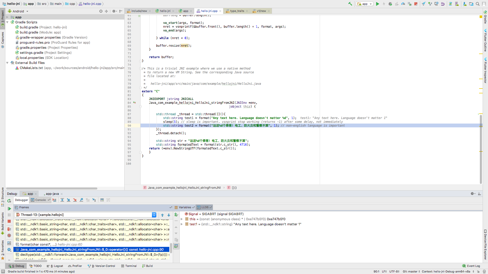
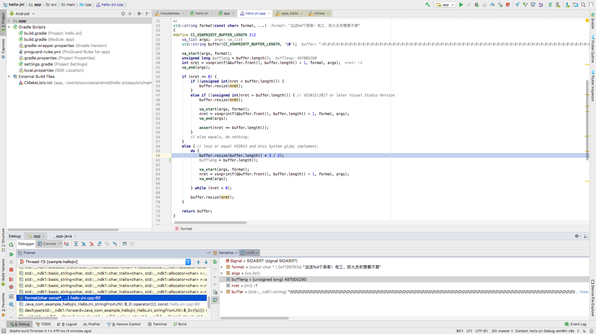

#### Description

On some Android devices `vsprintf` returns -1 with any buffer size inside separated thread for non-english languages. 

##### Steps to reproduce:
1. Take any format function (i've tried many). For example this one https://github.com/cocos2d/cocos2d-x/blob/cocos2d-x-3.17/cocos/base/ccUTF8.cpp#L43
2. Call format function in separated thread twice with delay (1-2 sec) with non-english language text. 

##### Example code: 
```
std::thread _thread = std::thread([](){
    std::string test1 = format("Any text here. Language doesn't matter %d", 1);
    // sleep is important. vsnprint stop working (returns -1) after some delay, not immediately
    sleep(2);
    // non-english language is important
    std::string test2 = format("运送%d个乘客！电工、防火员和警察不算", 1);
});
_thread.detach();
```

Or use this test case

#### Environment Details
 * NDK Version: staring from r15c (with r14b everything is fine)
 * Build system: cmake/ndk-build
 * Host OS: MacOS 10.13.6/Linux Ubuntu 16.04
 * Compiler: clang
 * ABI: armeabi-v7a
 * STL: c++_static
 * NDK API level: 16
 * Device API level: 24, 26 


##### Non-affected devices (tested)
* Samsung GT-I9082 (Android 4.2.2, API 17)
* Xiaomi Mi A1 (Android 8.1.0, API 27)
* DIGMA VOX S501 3G VS5002PG (Android 5.1, API 22)
* TCL 5065D (Android 5.1.1, API 22)
* Sony E5303 (Android 6.0 API 23)
* Google Pixel XL (Android 9, API 28)
* Google Pixel 3 XL (Android 9, API 28)

##### Affected devices (tested):
* Xiaomi Mi PAD 3 (Android 7.0.0, API 24)

##### Affected devices (according to top devices from crashlytics issue):
* HUAWEI HWI-AL00
* HUAWEI BKL-AL20
* HUAWEI BKL-AL00
* HUAWEI SNE-AL00
* HUAWEI BLN-AL20
* HUAWEI PRA-TL10
* HUAWEI BLN-AL40
* HUAWEI INE-AL00
* HUAWEI NXT-TL00
* Xiaomi Redmi Note 5A
* Xiaomi Redmi 6A
* Xiaomi MI 6
* Xiaomi MI 5s Plus
* vivo NEX A
* vivo Y75A
* vivo V1813BT
* vivo X21UD A
* OPPO A83
* OPPO PADM00
* OPPO A73
* OPPO R11t
* OPPO A77t

#### Screenshots:

